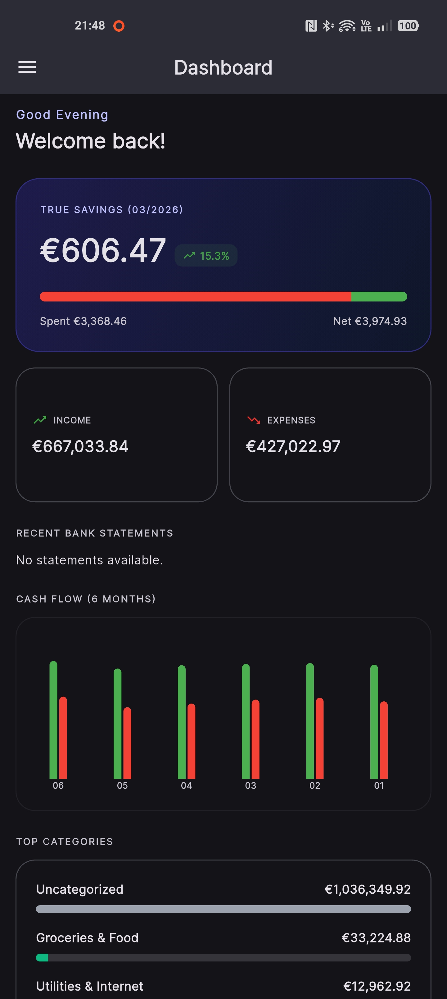
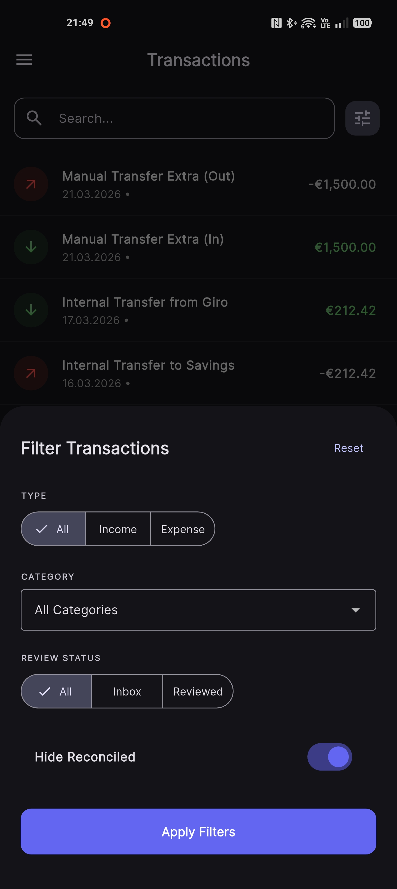
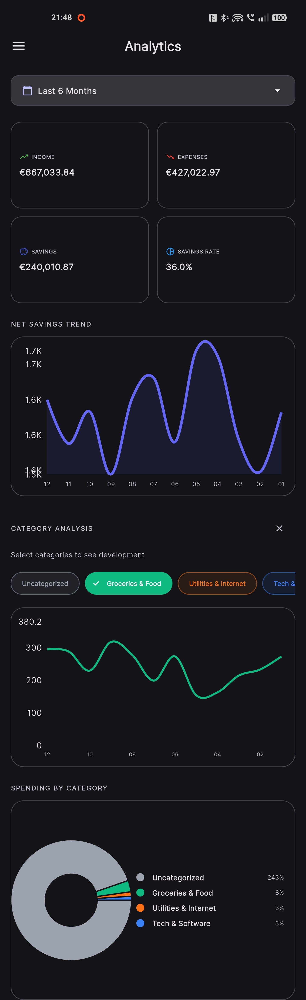
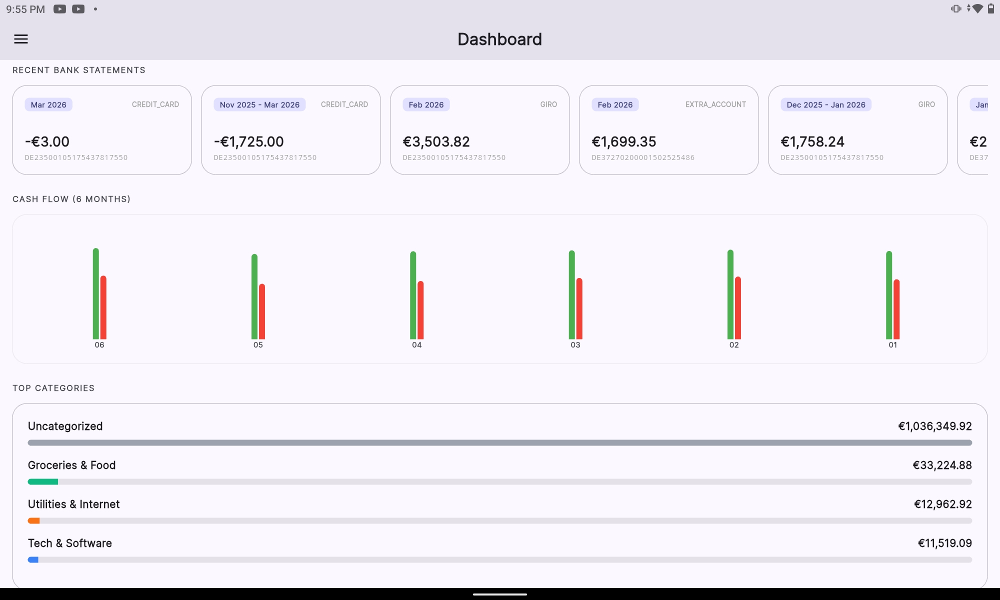
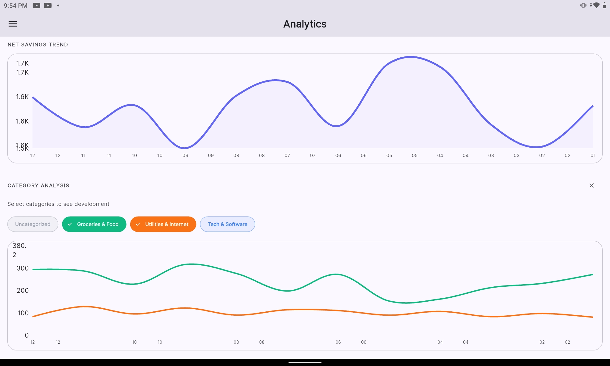

# 💰 CogniCash: Your Private AI Financial Center

CogniCash is a **privacy-first, self-hosted** financial engine that transforms raw banking data and documents into actionable insights. By combining **Strict Hexagonal Architecture** with **Local AI (Ollama)**, it provides a high-integrity platform for managing your entire financial life without ever leaking data to the cloud.

## 🌟 Why CogniCash?

* **🧠 Local-First AI Intelligence:** Leverage local LLMs (like Llama 3 via Ollama) to automatically parse and categorize **Invoices, Payslips, and Bank Statements**. Supports PDF and image formats via multimodal Gemini or AI-fallback paths. All AI processing happens **locally on your hardware**. Includes a **Hybrid Matcher** checking for high-confidence (65%+) historical matches before calling the AI.
* **🔮 Predictive Intelligence:** Look into your financial future with the **Forecasting Engine**. Automatically detects recurring patterns up to yearly intervals with a fixed 3-year historical lookback. Calculates a **Monthly Burn Rate** for variable categories and projects **Seasonal Bonuses**. Includes **Forecast Fine-Tuning** to mute or exclude specific projections.
* **🛡️ Privacy-First Integrity:** We maintain a strictly **personal-data-free codebase**. Our automated "deep-scrubbing" policy ensures all test data, logs, and documentation examples are completely anonymized or synthetic.
* **📜 Professional Payslip Management:** Master your HR documents with a dedicated **Payslip Engine**. Automatically extract Gross, Net, Payout, and Bonuses. Includes a **Split-View Preview** to compare the original PDF with the extracted data.
* **🏦 Offline-First Parsers:** Built-in, privacy-respecting offline parsers for major providers like **ING (DIBA), Amazon Visa, and VW/CARIAD**. These work entirely without AI for maximum speed and reliability.
* **📈 Precision Analytics:** Master your cash flow with deep-dive analytics, a dedicated **Review Mode (Inbox)** for new transactions, and a smart **Reconciliation Wizard** to link internal transfers.
* **🔁 Subscription Management:** Automatically identify recurring payments (Netflix, Rent, Insurance) from your transaction history. Approve suggested subscriptions to retroactively link and track your fixed costs with one click. Features **AI-powered Merchant Profiling**, **Configurable AI-driven pattern recognition**, and **One-click manual creation from transactions**.
* **🗄️ Unified Document Vault:** A centralized, encrypted repository for all your tax certificates, receipts, contracts, and other financial documents. Features **OCR-powered full-text search** and a dedicated **Tax Year View**.
* **👥 Multi-Tenant & Collaborative:** Built for **Full User Tenancy**. Includes **Shared Categories** for collaborative expense tracking without compromising personal net-worth privacy.
* **📱 Native Mobile App:** High-fidelity Flutter app with a **Cache-First (Isar)** architecture and **Mutation Outbox** for seamless financial management without a network connection.
* **🥧 Raspberry Pi 5 Ready:** Fully compatible with **ARM64** architectures.

## Intro Video

https://github.com/user-attachments/assets/44a99551-3589-4b79-b353-bb4d597fd291

---

## 📱 Mobile Experience (Beta)

Manage your finances on the go with the **CogniCash Mobile App**. Built with Flutter, it offers a seamless, offline-first experience that syncs perfectly with your self-hosted instance.

### ✨ Key Mobile Features

* **🤖 Local-First AI Recognition:** Snap a photo or upload a PDF of your payslips, bank statements, or invoices. The app uses local AI logic via your self-hosted backend.
* **📜 Payslip Master View:** Detailed management of your salary history, bonuses, and tax classes with high-fidelity charts.
* **🏦 ING DIBA & More:** Native support for the **ING DIBA offline parser**.
* **Offline-First:** View and manage your data even without an internet connection.
* **Native Performance:** Smooth 60fps animations and transitions.
* **🔁 Subscription Discovery & Management:** Track recurring costs and review AI-suggested subscriptions in the **Discovery Inbox** on the go.
* **Document Preview:** View original documents directly in the app while you edit or review extracted fields.
* **Biometric Security:** Protect your financial data with Fingerprint or Face ID.
* **🔏 License Management (Beta):** Transparent trial tracking with a dedicated **License & Trial** view. If expired, the app enters read-only **Vault Mode**.
* **Hardware ID:** Conveniently copy your unique, privacy-salted Hardware ID for manual license upgrades.

  

#### Smartphone Experience

  
  
  

#### Tablet Optimization

  
  

**Interested in the Mobile App?** I am preparing for a public release on the **Google Play Store**. Contact me to join the Beta Program: 👉 [support-cogni-cash@steierl.org](mailto:support-cogni-cash@steierl.org?subject=Interest%20in%20CogniCash%20Mobile)

---

## 📚 Documentation Directory

To keep this repository easy to navigate, detailed documentation has been split into dedicated files:

* **[Installation Guide](INSTALL.md):** General installation steps for Linux and Docker.
* **[Windows Installation Guide](WINDOWS_INSTALL.md):** Simplified, step-by-step guide for Windows users.
* **[Deployment & Setup Guide](docs/DEPLOYMENT.md):** Advanced deployment, Environment Variables, and Make commands.
* **[User Guide & UI Configuration](docs/USER_GUIDE.md):** Frontend capabilities, System Config, and i18n details.
* **[Architecture & Roadmap](docs/ARCHITECTURE.md):** Hexagonal design details, Tech Stack, and Project Roadmap.
* **[API Reference](docs/API_REFERENCE.md):** Overview of the RESTful API endpoints.
* **[Database Schema](docs/DATABASE_SCHEMA.md):** Comprehensive ERD, table definitions, and migration strategies.